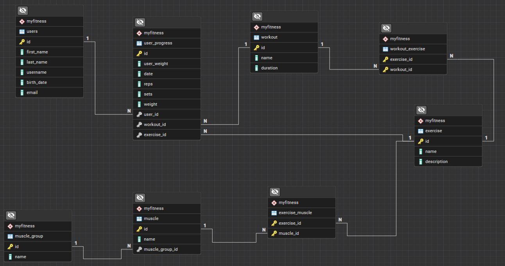

# 🏋️ Fitness Tracker - Database Model

Ovaj repozitorijum sadrži bazu podataka za fitness aplikaciju, uključujući SQL skriptu za kreiranje tabela i Java kod.

## 📥 Instalacija
1. Klonirajte repozitorijum:
   ```sh
   git clone https://github.com/k0ntrol/MyFitness.git
   
## 🛠️ Korišćenje

### Pokretanje aplikacije
1. Instalirajte PostgreSQL i podesite bazu podataka.
2. Klonirajte repozitorijum.
3. Konfigurišite `application.properties` sa vašim kredencijalima za bazu podataka.
4. Pokrenite aplikaciju koristeći Java IDE ili komandnu liniju.
## 📊 ER Dijagram


## 📂 Struktura baze podataka
Baza podataka sadrži sledeće tabele:

- **users** - Informacije o korisnicima (ime, prezime, email, itd.).
- **muscle_group** - Grupe mišića (npr. "Noge", "Ruke").
- **muscle** - Pojedinačni mišići, povezani sa grupama mišića.
- **exercise** - Vježbe sa opisima.
- **exercise_muscle** - Koje mišiće pogađaju odredjene vježbe.
- **workout** - Programi vježbanja.
- **workout_exercise** - Vježbe koje se nalaze na jednom programu.
- **user_progress** - Bilježenje napretka (ponavljanja, težina, datum).

## 🚀 Tehnologije
- **PostgreSQL** - Baza podataka
- **Java** - Backend (POJO modeli)
- **REST** - Za izradu RESTful API-ja
- **REST Jackson** - Za serijalizaciju i deserijalizaciju JSON podataka
- **REST Client** - Za komunikaciju sa drugim REST servisima
- **REST Client Jackson** - Za serijalizaciju i deserijalizaciju JSON podataka u REST klijentu
- **Hibernate ORM** - Za mapiranje objekata na relacione tabele
- **JDBC Driver - PostgreSQL** - Za povezivanje sa PostgreSQL bazom podataka
- **SmallRye OpenAPI** - Za generisanje OpenAPI dokumentacije
- **IntelliJ IDEA** - Razvojno okruženje
- **Git** - Za kontrolu verzija

## 📊 Status projekta

### 🚧 U razvoju 🚧

## 📝 Autor
👤 *Filip Cokovski*  
📕 *Broj indexa:53-23*  
📧 *fcokovski@gmail.com* 
